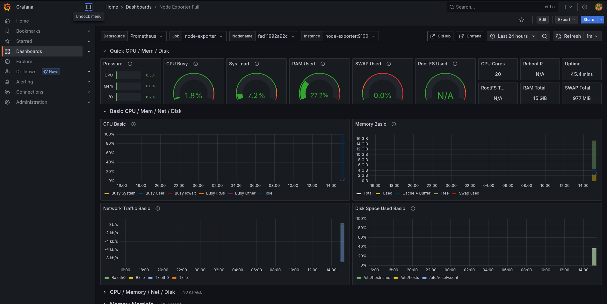
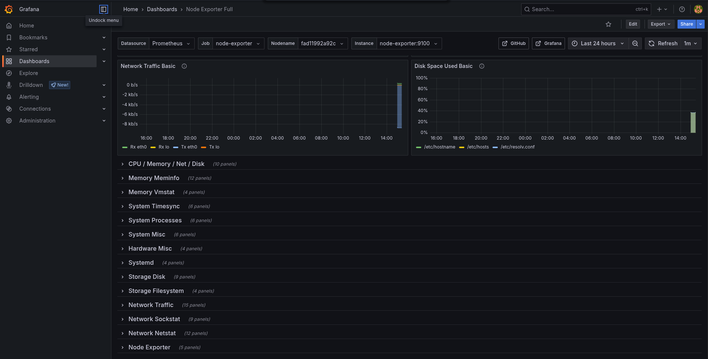
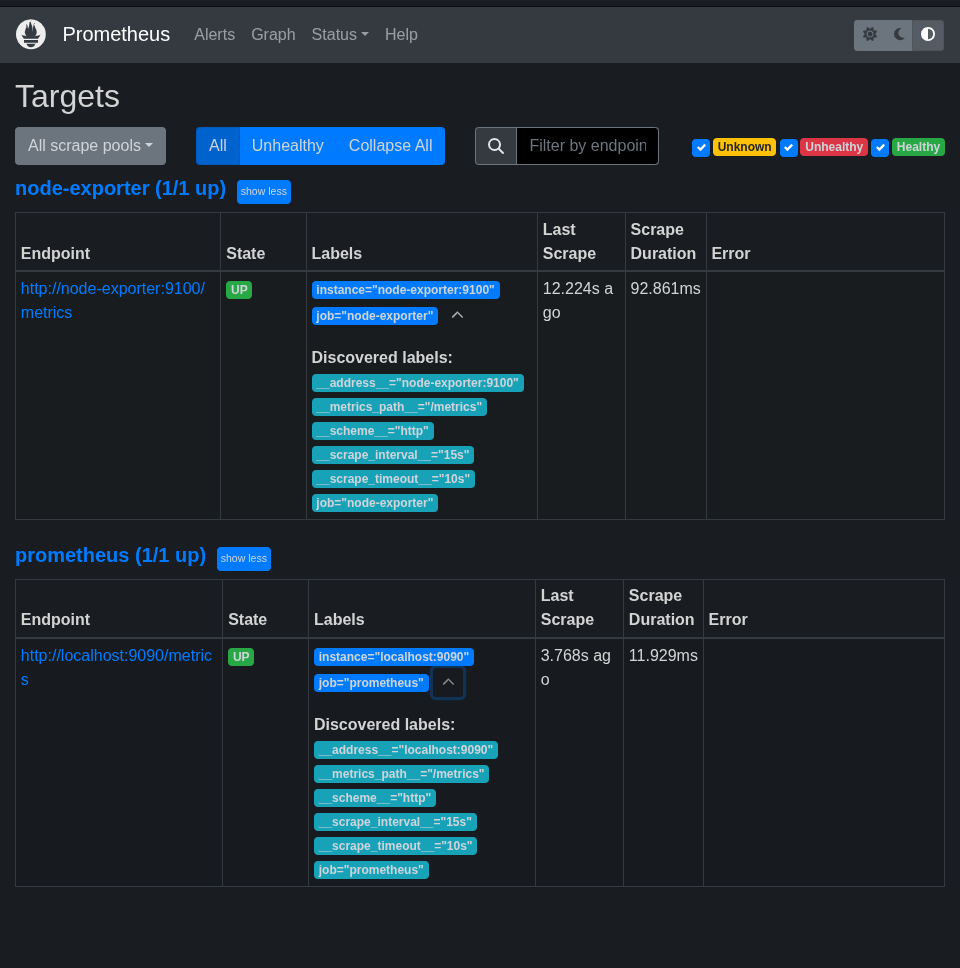

# 🚀 Monitorización con Prometheus y Grafana

## 📋 Descripción

Este proyecto configura un sistema básico de monitorización utilizando **Prometheus** y **Grafana** dentro de contenedores Docker.

- 🔍 **Prometheus** recolecta y almacena métricas del sistema.
- 📊 **Grafana** visualiza esas métricas a través de dashboards preconfigurados como **Node Exporter Full**.

El proyecto incluye un script (`setup_monitoreo.sh`) que automatiza la estructura de carpetas, la configuración inicial y el despliegue de los contenedores.

---

## ⚙️ Qué hace este proyecto

1. 📁 Crea la estructura de carpetas y archivos necesarios (`prometheus.yml`, `datasource.yml`, `docker-compose.yml`).
2. 📡 Configura Prometheus para hacer scraping de:
   - Sus propias métricas (localhost:9090)
   - Métricas del contenedor de Node Exporter
3. 🔗 Configura Grafana con una datasource apuntando automáticamente a Prometheus.
4. 🔐 Permite definir las credenciales de Grafana desde un archivo `.env`.
5. 🧩 Importa el dashboard "Node Exporter Full" para visualizar datos detallados del sistema.
6. 🐳 Levanta los servicios de Prometheus, Grafana y Node Exporter con Docker Compose.

---

## 🖼️ Ejemplos visuales

### 📊 Dashboard Node Exporter Full en Grafana

Este dashboard ofrece visualización de CPU, Memoria, Disco, Red, procesos del sistema, carga del sistema, etc.




### 🔍 Interfaz de Prometheus

Desde aquí puedes consultar métricas con PromQL y ver series temporales en crudo.



---

## 🚀 Cómo usarlo

1. Clona este repositorio:

```bash
git clone https://github.com/tu_usuario/Monitorizacion.git
cd Monitorizacion
```
2. Crea tus propias credenciales en el fichero `.env`

3. Ejecuta el ejecutable.

4. Accede a Grafana en http://localhost:3000 con las credenciales que definiste y empieza a explorar.

5. Diviértete probando y ampliando el sistema. Este proyecto es una base sólida para entender qué es la monitorización y cómo aplicarla.


---
👨‍💻 Autor: [Andrés Morales González](https://github.com/madand1)
